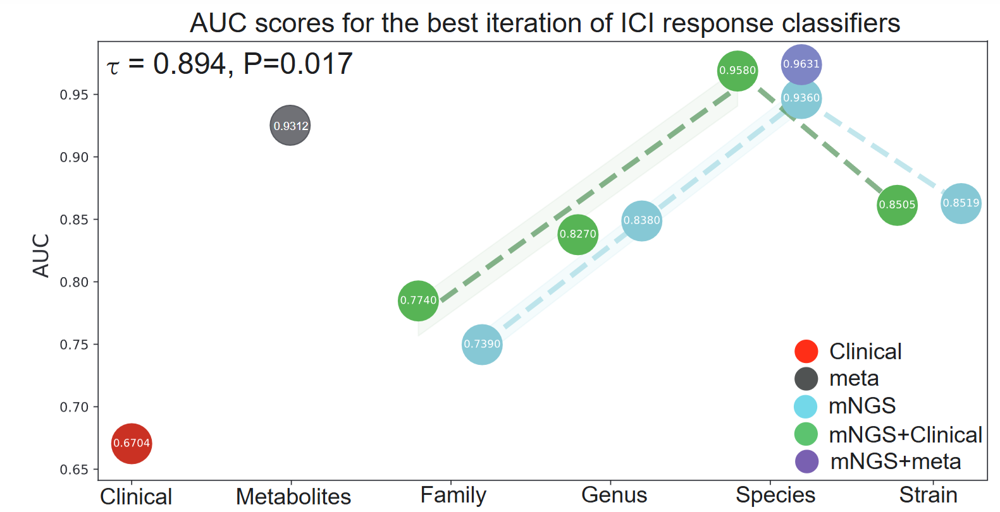

# A Lung Microbial Signature for Response to First-line Immune Checkpoint Blockade in Advanced Lung Cancer 


<!--  -->


## Overview
In the neural network model section of this study, we developed a highly interpretable training strategy known as robust dynamic feature selection. This approach, combined with gated neural networks, significantly mitigates the black-box nature of deep learning models in biomedical applications.
### Highlights:
- **Novel Approach:** Integration of dynamic feature selection with gated neural networks for increased interpretability.
- **High Performance:** AUC of 0.96, setting a benchmark in pulmonary microbiota studies related to immunotherapy.
- **Data Utilization:** Examination of various biological informational levels – Clinical, Metabolites, Family, Genus, Species, Strain.

## Perfoermance

<!-- <p align="center"> -->
 
- The AUC (Area Under the Curve) scores for the best iteration of ICI (Immune Checkpoint Inhibitor) response classifiers.
- The X-axis represents the data feature sources used by the classifiers, including Clinical, Metabolites, Family, Genus, Species, and Strain. These feature sources represent different biological information levels commonly employed in predicting ICI treatment responses.

- **AUC Scores:** Depict the performance of ICI response classifiers using different data features.
- **X-Axis:** Represents the data feature sources employed, such as Clinical, Metabolites, Family, Genus, Species, and Strain.
- **Composite Features:** Combination of mNGS and meta features yielded the highest AUC (0.9631).

## Files in "Code" directory

- **`Data_process.ipynb`:** Transforms raw data into formatted tables processable by the model.
- **`Cli_mNGS_run.py`:** Identifies significant clinical and microbial features using our model.
- **`Metabolic_run.py`:** Executes second-stage screening integrating metabolic features.
- **`trainer.py`:** Core logic and robust feature assessment through parameter searching.
- **`utils.py`:** Utility functions for various operations.
- **`models.py`:** Defines the neural network model architecture.

## Instructions

To replicate the results:
1. **Clone this Repository:**
   ```bash
   git clone https://github.com/AmFe-GH/LMS-ALC.git
   ```

2. **Enter your Conda Environment:**
   ```bash
   conda activate <your_env_name>
   ```

3. **Install Required Packages:**
   ```bash
   pip install -r requirements.txt
   ```

4. **Run the Feature Selection Script:**
   ```python
   python Cli_mNGS_run.py
   ```

## Citation

If this code contributes to your research, please consider citing our original paper:

> **Authors:** [Names and Affiliations]  
> **Title:** A Lung Microbial Signature for Response to First-line Immune Checkpoint Blockade in Advanced Lung Cancer  
> **Journal/Conference:** [Details]  
> **DOI:** [Link]

##    Acknowledgements
<!-- 
This work was supported by National Natural Science Foundation of China
(Grant 12101430) and Department of Science and Technology of Sichuan
Province (Grant 2021ZYD0018). (Corresponding author: Cong Wu.)(https://yjs.cd120.com/contents/559/1710.html) -->
